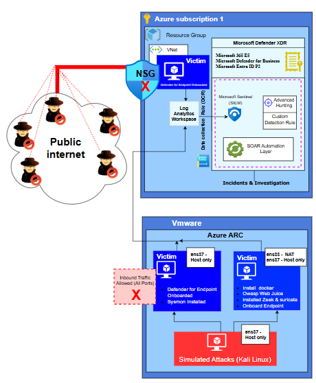

# Hybrid Microsoft Sentinel SOC Detection & Incident Response Laboratory

This project is a hybrid Microsoft Sentinel Security Operations Center (SOC) laboratory designed to simulate real-world cyberattacks and validate detection, investigation, and incident response capabilities across both cloud and on-premises environments. The lab integrates Microsoft Sentinel (SIEM), Microsoft Defender XDR, Microsoft Defender for Endpoint, Microsoft Entra ID, Azure ARC, and Log Analytics Workspace to provide centralized visibility and security monitoring.

The environment consists of four machines: a Kali Linux attack machine, an Ubuntu server and a Windows 10 endpoint running in VMware, and a Windows 10 virtual machine hosted in Microsoft Azure. The VMware-hosted systems are onboarded to Microsoft Defender for Endpoint and Azure ARC. Security telemetry from all monitored assets is centralized in Microsoft Sentinel, enabling real-time threat detection, incident correlation, advanced hunting, automated investigations, and response workflows.

The laboratory supports the complete SOC lifecycle by simulating realistic attack scenarios, validating Microsoft security detections, investigating incidents using Microsoft Defender XDR and Microsoft Sentinel, performing threat hunting with Kusto Query Language (KQL), and documenting response actions from initial compromise through containment and remediation. The project demonstrates practical experience in deploying, monitoring, detecting, investigating, and responding to cyber threats using Microsoft's enterprise security ecosystem.

