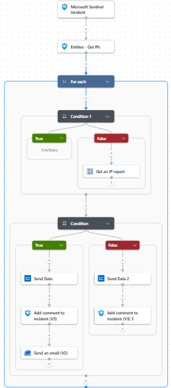
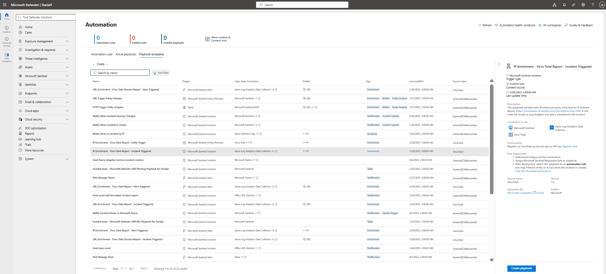
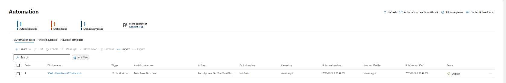
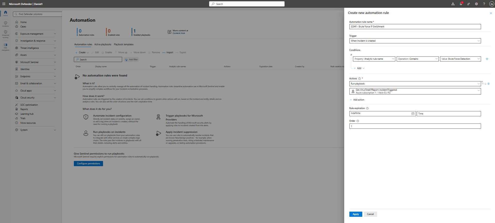
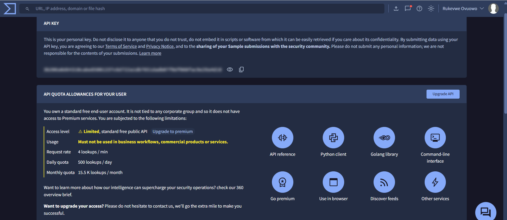
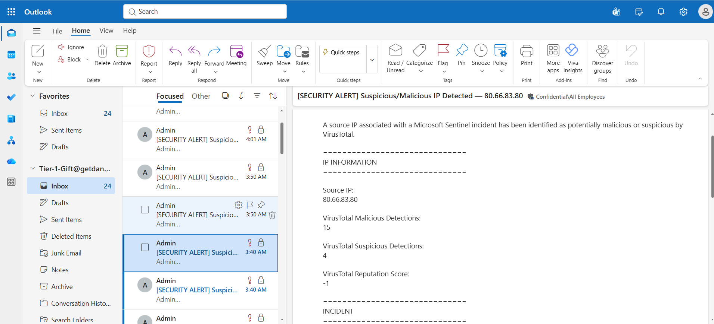
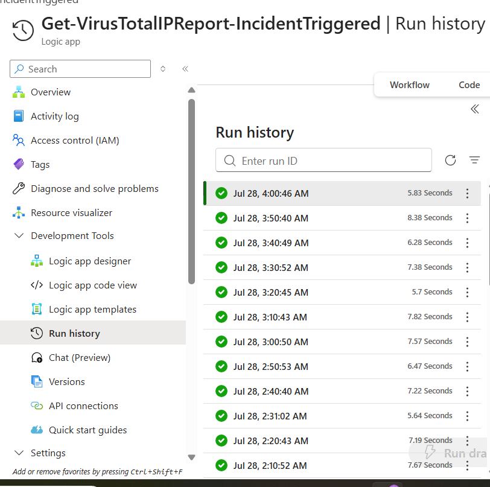

# SOAR Investigation — Brute-Force Detection, IP Enrichment & SOC Notification

**Author:** Ovuowo Rukevwe  
**Role:** SOC Analyst — Security Home Lab  
**Platform:** Microsoft Defender XDR / Microsoft Sentinel / Azure Logic Apps  
**Threat Intelligence:** VirusTotal  
**Logging:** Azure Log Analytics  
**Notification:** Outlook / Microsoft 365  
**Attack Type:** Brute Force  
**Severity:** High  
**Status:** Published and Operational  
**Investigation Period:** July 2026  

---

# 01 — Executive Summary

This investigation demonstrates an automated SOC workflow for detecting a brute-force attack, extracting the source IP, enriching public IP addresses with VirusTotal threat intelligence, recording the enrichment in Log Analytics, updating the Microsoft Sentinel incident, and notifying the SOC when malicious or suspicious activity is detected.

The workflow was intentionally designed to follow a practical SOC process:

```
Detect
  ↓
Extract
  ↓
Filter
  ↓
Enrich
  ↓
Assess Risk
  ↓
Record Evidence
  ↓
Notify SOC
```


The workflow was successfully tested and published.

Key Result

The final automation successfully:

received a Microsoft Sentinel incident;
extracted IP entities;
filtered private IP addresses;
queried VirusTotal only for public IP addresses;
evaluated malicious/suspicious VirusTotal detections;
wrote enrichment data to Log Analytics;
added investigation context to the Sentinel incident;
sent SOC notification for detected risk.

Evidence:



# 03 — SOAR Architecture
Brute-Force Activity
        ↓
Microsoft Sentinel Incident
        ↓
Entities - Get IPs
        ↓
For each IP
        ↓
Condition 1 — Private IP?
        │
        ├── TRUE
        │     ↓
        │   Private IP
        │     ↓
        │   Skip VirusTotal
        │
        └── FALSE
              ↓
          Public IP
              ↓
       Get an IP Report
              ↓
          Condition 2
              ↓
   Malicious > 0 OR
   Suspicious > 0?
          /       \
       TRUE       FALSE
         ↓          ↓
    Risk Found   No Detection
         ↓          ↓
   Log + Comment Log + Comment
         ↓
   SOC Notification


### Architectural Decision

The final risk decision does not rely on:

Reputation >= 0

Instead, the workflow evaluates:

malicious > 0
OR
suspicious > 0

This is a more meaningful threat-intelligence decision because it directly evaluates VirusTotal's analysis results.


# 04 — Sentinel Automation

The implementation started inside Microsoft Sentinel by navigating to the Automation area.

The purpose was to connect a security incident to an automated Logic App playbook.

### Process
Open Microsoft Sentinel.
Navigate to Automation.
Review available SOAR/playbook templates.
Select the appropriate template.
Deploy the template.
Configure the required connections.
Customize the workflow.
Test the automation.
Publish the playbook.

Evidence:



# 05 — SOAR Template Selected

The selected template was:

SOAR - Brute Force IP Enrichment

This template was used as the starting point for the automation.

The template provided the basic incident-driven structure for extracting an IP entity and enriching it with external threat intelligence.

The workflow was then customized to make the implementation more robust.

Evidence:



# 06 — Playbook Deployment

The deployed playbook was:

Get-VirusTotalIPReport-IncidentTriggered

The playbook is triggered by a Microsoft Sentinel incident.

The core workflow was then expanded to include:

private IP filtering;
VirusTotal enrichment;
risk evaluation;
Log Analytics ingestion;
Sentinel incident comments;
SOC notification.

Evidence:



# 07 — Brute-Force Detection to Sentinel Incident

The brute-force simulation generated authentication activity that triggered the detection rule.

The resulting alert was associated with a Microsoft Sentinel incident.

This created the trigger for the SOAR workflow.

```
Brute-Force Activity
        ↓
Detection Rule
        ↓
Microsoft Sentinel
        ↓
Incident
        ↓
Logic App / SOAR
```

This demonstrates an incident-driven automation model, rather than a manually executed response script.


# 08 — Extract IP Entities

The playbook uses:

Entities - Get IPs

This extracts IP entities associated with the Sentinel incident.

The resulting IPs are passed into a:

For each

loop.

This allows multiple IP entities to be processed independently.


# 09 — Sequential Processing

The For each loop was initially capable of parallel execution.

It was changed to:

Concurrency:
ON

Limit:
1

This means IPs are processed sequentially.

Why?

The VirusTotal free API has request-rate restrictions.

Sequential processing reduces the chance of generating unnecessary concurrent API requests.

It also makes the workflow easier to troubleshoot and control.


# 10 — Condition 1: Private vs Public IP

Before calling VirusTotal, the workflow determines whether the IP is a private/internal address.

The condition checks:

10.0.0.0/8

172.16.0.0/12

192.168.0.0/16
Decision
Private IP?
     │
     ├── TRUE
     │     ↓
     │   Skip VirusTotal
     │
     └── FALSE
           ↓
         Public IP
           ↓
      VirusTotal

This prevents internal addresses from being unnecessarily submitted to an external threat-intelligence service.

Example private IP observed during testing:


192.168.138.1

Example public IP:

45.76.249.19


# 11 — VirusTotal IP Enrichment

Public IP addresses are passed to the:

Get an IP report

VirusTotal action.

The workflow retrieves information including:

data.attributes.reputation

data.attributes.last_analysis_stats.malicious

data.attributes.last_analysis_stats.suspicious

The workflow uses the analysis statistics as the primary risk signal.

Evidence:



# 12 — Troubleshooting: VirusTotal HTTP 429

During initial testing, the workflow repeatedly failed.

The failure was:

HTTP 429

QuotaExceededError

Quota exceeded

The failure occurred specifically at:

Get an IP report

This demonstrated that the Sentinel trigger and workflow structure were functioning, but the external threat-intelligence API was rejecting requests because of quota/rate limitations.

Investigation

The VirusTotal account showed a standard free API allowance with a limited request rate.

The workflow was therefore reviewed for unnecessary API calls.


### Improvements

The following controls were introduced:

```
Private IP filtering
        ↓
Only public IPs go to VirusTotal

For each
        ↓
Concurrency limited to 1

VirusTotal
        ↓
Only one lookup processed at a time
```

The workflow was subsequently rerun when the API quota became available.

### Result

The workflow eventually returned successful executions.

This troubleshooting process is important evidence that the project was not simply built and screenshotted — it was actually tested and debugged.


# 13 — Condition 2: Threat Intelligence Risk Decision

The original logic used:

Reputation >= 0

This was replaced because it was not sufficiently meaningful as a maliciousness decision.

The final logic is:

malicious > 0
OR
suspicious > 0
Meaning

If either VirusTotal detects:

malicious > 0

OR:

suspicious > 0

the workflow treats the IP as requiring attention.


### Decision

```
VirusTotal
     ↓
Malicious > 0
OR
Suspicious > 0?
     │
     ├── TRUE
     │     ↓
     │   Risk detected
     │
     └── FALSE
           ↓
       No detection
```

This is more defensible than treating a generic reputation score as the sole risk indicator.


# 14 — Log Analytics Integration

The VirusTotal response is sent to Azure Log Analytics.

The custom log type is:

VTIPReport

This produces the custom table:

VTIPReport_CL

This creates a persistent investigation record that can be queried after the Logic App execution has completed.

Example KQL:

VTIPReport_CL
| where id_s == "45.76.249.19"

This allows the SOC analyst to correlate the IP enrichment with the incident.


# 15 — Automated Sentinel Incident Comment

The playbook automatically updates the Sentinel incident with the VirusTotal investigation results.

For a risk-detected result, the comment includes:

source IP;
malicious detections;
suspicious detections;
reputation score;
Log Analytics query.

Example:

VirusTotal IP Report found for <IP>

VirusTotal analysis detected potential malicious
or suspicious activity.

Malicious detections: <value>
Suspicious detections: <value>

Reputation score: <value>

Query:
VTIPReport_CL | where id_s == "<IP>"

For a clean result, the comment states that VirusTotal returned no malicious or suspicious detections.

# 16 — SOC Notification

The risk branch was extended with:

Outlook — Send an email (V2)

The notification is triggered when:

malicious > 0
OR
suspicious > 0

The purpose is to make sure a potentially malicious or suspicious IP generates an explicit SOC notification rather than remaining visible only inside the playbook execution history.

```
Notification flow
VirusTotal
     ↓
Risk Decision
     ↓
Malicious OR Suspicious
     ↓
Incident Comment
     ↓
SOC Email
```

The email contains the information required by a Tier-1 analyst to begin triage.




# 17 — Successful Validation

After the troubleshooting and workflow improvements, the automation successfully executed.

A successful run demonstrated:

```
Microsoft Sentinel Incident
        ↓
Entities - Get IPs
        ↓
For each
        ↓
Condition 1
        ↓
Get an IP report
        ↓
Condition 2
        ↓
Send Data
        ↓
Add Comment to Incident
```


One successful run completed in approximately:
2.94 seconds

The successful execution processed:

45.76.249.19

and created an incident comment containing the VirusTotal enrichment.


# 18 — Evidence of Repeated Successful Execution

After the API quota issue was resolved, multiple subsequent runs completed successfully.

The run history showed repeated successful executions over several hours.

This is stronger evidence than a single successful test because it demonstrates that the automation remained functional across repeated executions.

Evidence:


# 19 — Final SOAR Workflow

The final workflow can be summarized as:

                    BRUTE-FORCE ATTACK
                           │
                           ▼
                    Detection Rule
                           │
                           ▼
                 Microsoft Sentinel
                      Incident
                           │
                           ▼
                  Entities - Get IPs
                           │
                           ▼
                       For each
                           │
                           ▼
                 ┌───────────────────┐
                 │   Condition 1     │
                 │   Private IP?     │
                 └───────────────────┘
                    │             │
                  TRUE           FALSE
                    │             │
                    ▼             ▼
                  SKIP        VirusTotal
                                │
                                ▼
                         Condition 2
                                │
                 malicious > 0 OR
                 suspicious > 0
                         │          │
                       TRUE        FALSE
                         │          │
                         ▼          ▼
                 Log + Comment  Log + Comment
                         │
                         ▼
                   SOC Notification
                         │
                         ▼
                     SOC Triage


The following have intentionally NOT been added to this playbook:


Host Isolation
IP Blocking
Account Disablement
Automated Containment
Automated Incident Closure
Full Incident Lifecycle Management

These will be implemented in separate playbooks for other simulated attacks.

This keeps the automation modular and attack-specific.


# 20 — Lessons Learned

The most important lesson from this project was:

SOAR automation is not simply about connecting actions. It must be designed around security logic, API limitations, failure handling, evidence, and analyst workflow.

The initial workflow failed because the external VirusTotal API returned:

429 — QuotaExceededError

Instead of assuming that the detection was broken, the workflow was investigated step-by-step.

The final solution introduced:

```
Private IP Filtering
        +
Sequential Processing
        +
Explicit Risk Logic
        +
Persistent Logging
        +
Incident Documentation
        +
SOC Notification

```


This made the automation more controlled and operationally useful.

The project successfully demonstrates an incident-driven SOAR workflow from brute-force detection through threat intelligence enrichment and SOC notification.

The final capability is:

```
DETECT
   ↓
EXTRACT
   ↓
FILTER
   ↓
ENRICH
   ↓
ASSESS
   ↓
LOG
   ↓
DOCUMENT
   ↓
NOTIFY

```


The implementation also demonstrates the ability to troubleshoot a real external API failure and improve the architecture based on the observed failure.


 
## Next Phase

This brute-force SOAR workflow is considered complete for the current stage.

The next attack simulations will demonstrate:

```
Stage 4 — Containment
        ↓
Stage 5 — Incident Management
```

These will be implemented using different attack scenarios so that the portfolio demonstrates multiple SOC response strategies rather than one oversized playbook.


